&nbsp;&nbsp;
&nbsp;&nbsp;
&nbsp;&nbsp;
&nbsp;&nbsp;

# Package of the Day

</img>
Introduction to flutter packages: This repo will teach you some of the popular packages that are available in [pub.dev](https://pub.dev), & how to use them for fast application development. 
Playlist URLs:  
[YouTube](https://www.youtube.com/watch?v=GEMoJxqpzhs&list=PLlvRDpXh1Se6mtlWw6pE9MXZ2o4k_KULp)  
[YouTube: provider](https://www.youtube.com/watch?v=L_QMsE2v6dw) 
[YouTube: image_picker](https://www.youtube.com/watch?v=MSv38jO4EJk) 
[YouTube: shimmer](https://www.youtube.com/watch?v=yhABSANrsNc) 
[YouTube: shared_preferences](https://www.youtube.com/watch?v=5hQNFQ3y6UY) 
[YouTube: geolocator](https://www.youtube.com/watch?v=04U6xRK8bjg) 
[YouTube: url_launcher](https://www.youtube.com/watch?v=dofN2lqEQ3w) 
[YouTube: webview_flutter](https://www.youtube.com/watch?v=LyAwnwvbBKM) 
[YouTube: video_player](https://www.youtube.com/watch?v=uz4xRnE-UIw) 
[YouTube: responsive_framework](https://www.youtube.com/watch?v=bXwK1Lrfihw&t=871s) 
[YouTube: introduction_screen](https://www.youtube.com/watch?v=CQlA2p--oEg) 
[YouTube: confetti](https://www.youtube.com/watch?v=lowMUJI5iP4) 
[YouTube: connectivity_plus](https://www.youtube.com/watch?v=_DaLGGzt8Hc) 
[YouTube: flutter_hooks](https://www.youtube.com/watch?v=hiqpPKF_fic&t=287s) 
[YouTube: flutter_slidable](https://www.youtube.com/watch?v=TmSKRUVKNsQ) 
[YouTube: json_annotation](https://www.youtube.com/watch?v=v5xGLrhzDGE) 
[YouTube: file_picker](https://www.youtube.com/watch?v=LlO5jydXws0) 
[YouTube: share_plus](https://www.youtube.com/watch?v=CNUBhb_cM6E) 
[YouTube: cache_network_image](https://www.youtube.com/watch?v=6wvD-Z-9ZRM) 
[YouTube: flutter_local_notifications](https://www.youtube.com/watch?v=bRy5dmts3X8) 
[YouTube: pixel_perfect](https://www.youtube.com/watch?v=L4G_ylrmKQ8) 

## Packages List:

1. [Avatar Glow](/lib/1_avatar_glow/avatarglow.dart) > StatelessWidget
2. [Google Fonts](/lib/2_google_fonts/googlefonts.dart)
3. [Liquid pull to Refresh](/lib/3_liquid_pull_to_refresh/pull_to_refresh.dart) > StatelessWidget > LiquidPullToRefresh > ListView
4. [Percent Indicator](/lib/4_percent_indicator/percent_indicator.dart)
5. [Carousel Slider](/lib/5_carousel_slider/carousel_slider.dart) > slideTransform: const CubeTransform() > CircularSlideIndicator
6. [Smooth Page Indicator](/lib/6_smooth_page_indicator/smooth_page_indicator.dart) > SmoothPageIndicator > (controller: \_controller,count: 4) > JumpingDotEffect
7. [Font Awesome Flutter](/lib/7_font_awesome_flutter/font_awesome_flutter.dart) > FaIcon > FontAwesomeIcons.arrowUp
8. [Animations](/lib/8_animations/animations.dart) > Container transform
9. [Neon](/lib/9_neon/neon.dart) > text > color > fontSize > font: NeonFont.Cyberpunk > flickeringText: true
10. [Aurora](/lib/10_aurora_gradient/aurora.dart) > backgroundColor: Colors.black > Aurora > size > color list
11. [Card Swiper](/lib/11_card_swiper/card_swiper.dart) > itemCount > autoplay: true > autoplayDelay > Card  
    Require a model.dart > BannerImageModel >
12. [Flutter Blurhash](/lib/12_flutter_blurhash/flutter_blurhash.dart) > BlurHash > hash (String) > image (from network)
13. [Flutter SVG](/lib/13_flutter_SVG/flutter_svg.dart) > Container > SvgPicture.asset() or SvgPicture.network()
14. [Flutter Custom Clipper](/lib/14_flutter_custom_clippers/flutter_custom_clippers.dart) >
15. [Flutter TTS](/lib/15_flutter_tts/flutter_tts.dart) > StatefulWidget
16. [Flutter Highlight](/lib/16_flutter_highlight/flutter_highlight.dart)
17. [Syncfusion Charts](/lib/17_syncfusion_flutter_charts/syncfusion_flutter_charts.dart)
18. [Rflutter Alert](/lib/18_rflutter_alert/rflutter_alert.dart) > ElevatedButton > child > Alert > (context, title, desc).show()
19. [Settings UI](/lib/19_flutter_settings_ui/flutter_settings_ui.dart) > SettingsList > sections:[] > SettingsSection > SettingsTile
20. [Flutter Spinkit](/lib/20_flutter_spinkit/flutter_spinkit.dart) > SpinKitRotatingCircle(color: Colors.redAccent)
21. [Audioplayers](/lib/21_audioplayers/audioplayers.dart) > AudioCache audioCache > late AudioPlayer player > void playAudio() > void stopAudio()
22. [Go Router](/lib/22_go_router/go_router.dart) > MaterialApp.router > routeInformationParser: \_router.routeInformationParser > routerDelegate: \_router.routerDelegate
23. [HTTP](/lib/23_http/http.dart) > watch this [YouTube](https://www.youtube.com/watch?v=ZEnWA8c3e_4) video
24. [Onboarding](/lib/24_onboarding/onboarding.dart) > onboardingPagesList > PageModel > widget > Column > Container >
25. [Flutter Neumorphic](/lib/25_flutter_neumorphic/flutter_neumorphic.dart) > [Github](https://github.com/Idean/Flutter-Neumorphic/blob/master/example/lib/samples/widgets_sample.dart)
26. [Math Expressions](/lib/26_math_expressions/math_expressions.dart) > Input type is string
27. [Clay Containers](/lib/27_clay_containers/clay_containers.dart) > ClayContainer > color > height >width
28. [Day Night Switcher](/lib/28_day_night_switcher/day_night_switcher.dart) > DayNightSwitcher / DayNightSwitcherIcon > dayBackgroundColor > isDarkModeEnabled > onStateChanged
29. [Provider](/lib/29_provider/my_provider.dart) > MultiProvider > ChangeNotifierProvider > create: (\_) => Counter() > child: MyHomePage()  
    class Counter with ChangeNotifier > notifyListeners();
30. [Feather Icons](/lib/30_feather_icons/feather_icons.dart) > Icon(FeatherIcons.aperture)
31. [Simple Gradient Text](/lib/31_simple_gradient_text/simple_gradient_text.dart) > GradientTex() > colors: const []
32. [Image Picker](/lib/32_image_picker/image_picker.dart) > watch the video, or read the [documentation](https://pub.dev/packages/image_picker) for iOS support.
33. [Convex Bottom Bar](/lib/33_convex_bottom_bar/convex_bottom_bar.dart) > read the code
34. [Intro Slider](/lib/34_intro_slider/intro_slider.dart) > read the code
35. [Icofont Flutter](/lib/35_icofont_flutter/icofont_flutter.dart) > Icon() > IcoFontIcons.cab > color: Colors.white > size: 40
36. [Flutter Staggered Grid View](/lib/36_flutter_staggered_grid_view/flutter_staggered_grid_view.dart) > GridView.custom > gridDelegate > pattern
37. [Shimmer](/lib/37_shimmer/shimmer.dart) > watch this [video](https://www.youtube.com/watch?v=yhABSANrsNc)
38. [Lottie](/lib/38_lottie/lottie.dart) > make an animation controller for controlling the state of the animation
39. [Shared Preferences](/lib/39_shared_preferences/shared_preferences.dart) > watch this [video](https://www.youtube.com/watch?v=5hQNFQ3y6UY)
40. [Auto Size Text](/lib/40_auto_size_text/auto_size_text.dart) > AutoSizeText() > minFontSize: 18 > maxLines: 4 > overflow: TextOverflow.ellipsis
41. [Device Info Plus](/lib/41_device_info_plus/device_info_plus.dart) > deviceInfo() async{} > DeviceInfoPlugin deviceInfo = DeviceInfoPlugin(); > IosDeviceInfo iosInfo = await deviceInfo.iosInfo; > setState((){})
42. [Geolocator](/lib/42_geolocator/geolocator.dart) > LocationPermission permission > await Geolocator.requestPermission() > Geolocator.getCurrentPosition()
43. [Glass Kit](/lib/43_glass_kit/glass_kit.dart) > GlassContainer.clearGlass > height > width > child
44. [URL Launcher](/lib/44_url_launcher/url_launcher.dart) > MaterialButton > onPressed: () async > if (await canLaunch(\_url)) > else
45. [Webview Flutter](/lib/45_webview_flutter/webview_flutter.dart) > WebView > javascriptMode: JavascriptMode.unrestricted > initialUrl: 'https://amazon.com' > onWebViewCreated: (controller){}
46. [Responsive Sizer](/lib/46_responsive_sizer/responsive_sizer.dart) > ResponsiveSizer( builder: (context, orientation, screenType) { return: Center()}) > height: 20.h > width: 20.w
47. [Video Player](/lib/47_video_player/video_player.dart) > watch the [video](https://www.youtube.com/watch?v=uz4xRnE-UIw)
48. [Responsive Framework](/lib/48_responsive_framework/responsive_framework.dart) > builder: (context, widget) => ResponsiveWrapper.builder() > ResponsiveBreakpoint > ResponsiveRowColumn() > ResponsiveVisibility() > ResponsiveValue()
49. [Timelines](/lib/49_timelines/timelines.dart) > Timeline.tileBuilder > TimelineTileBuilder.fromStyle
50. [Just Audio](/lib/50_just_audio/just_audio.dart) > check the code
51. [Persistent Bottom Nav Bar](/lib/51_persistent_bottom_nav_bar/bottom_nav_bar.dart) > check the code
52. [Equatable](/lib/52_equatable/equatable.dart) > class User extends Equatable > List< Object?> get props => [name, urlImage];
53. [Web Scraper](/lib/53_web_scraper/web_scraper.dart) > read documentation
54. [Introduction Screen](/lib/54_introduction_screen/onbording_screen.dart) > next > done > onDone > pages
55. [Animated Text Kit](/lib/55_animated_text_kit/animated_text_kit.dart) > read documentation from [here](https://pub.dev/packages/animated_text_kit)
56. [Horizontal Data Table](/lib/56_horizontal_data_table/horizontal_data_table.dart) > read code
57. [Confetti](/lib/57_confetti/confetti.dart) > bool isPlaying = false > final controller = ConfettiController()
58. [Chewie](/lib/58_chewie/chewie_player.dart) > final VideoPlayerController videoPlayerController > final bool looping > late ChewieController \_chewieController > Chewie(controller: \_chewieController,)
59. [Get It](/lib/59_get_it/get_it.dart) > GetIt getIt = GetIt.instance > getIt.registerSingleton< AppModel>(AppModelImplementation(), signalsReady: true) > FutureBuilder > future: getIt.allReady()
60. [Overlay Support](/lib/60_overlay_support/overlay_support.dart) > showSimpleNotification() > Text("simple notification") > background: Colors.green
61. [Connectivity Plus](/lib/61_connectivity_plus/connectivity_plus.dart) > late StreamSubscription subscription > subscription = Connectivity().onConnectivityChanged.listen((result) {showConnectivitySnackBar(context, result);}
62. [Flutter Hooks](/lib/62_flutter_hooks/flutter_hooks.dart) > class MyFlutterHooks extends HookWidget > final usernameController = useTextEditingController() > final passwordController = useTextEditingController()
63. [Path Provider](/lib/63_path_provider/path_provider.dart) > Directory tempDir = await getTemporaryDirectory(); > await getApplicationDocumentsDirectory();
64. [Youtube Player Flutter](/lib/64_youtube_player_flutter/youtube_player_flutter.dart) > late YoutubePlayerController \_controller ? YoutubePlayerBuilder() > player: YoutubePlayer(controller: \_controller) > builder: (context, player) {}
65. [Youtube Player Iframe](/lib/65_youtube_player_iframe/youtube_player_iframe.dart) > late YoutubePlayerController \_controller > \_controller = YoutubePlayerController()
66. [Flutter Slidable](/lib/66_flutter_slidable/flutter_slidable.dart) > Read code
67. [JSON Annotation](/lib/67_json_annotation/json_annotation.dart) > '$ flutter packages pub run build_runner build' > Read code
68. [Dio](/lib/68_dio/dio.dart) > Read code
69. [Gallery Saver](/lib/69_gallery_saver/gallery_saver.dart) > watch this [video](https://www.youtube.com/watch?v=JILcQLZvjKE&list=LL&index=2)
70. [Anim Search Bar](/lib/70_anim_search_bar/anim_search_bar.dart) > \_searchController.addListener(() {}) > Read the code
71. [File Picker](/lib/71_file_picker/file_picker.dart) > watch this [video](https://www.youtube.com/watch?v=LlO5jydXws0)
72. [Share Plus](/lib/72_share_plus/share_plus.dart) > watch this [video](https://www.youtube.com/watch?v=CNUBhb_cM6E)
73. [Infinite Scroll Pagination](/lib/73_infinite_scroll_pagination/infinite_scroll_pagination.dart) > read documentation from [here](https://pub.dev/packages/infinite_scroll_pagination)
74. [Marquee](/lib/74_marquee/marquee.dart) > text > scrollAxis > crossAxisAlignment > blankSpace > velocity > pauseAfterRound > startPadding
75. [Cached Network Image](/lib/75_cached_network_image/cached_network_image.dart) > watch this [video](https://www.youtube.com/watch?v=6wvD-Z-9ZRM)
76. [Flutter Toast](/lib/76_fluttertoast/fluttertoast.dart) > Fluttertoast.showToast() > msg > fontSize > textColor > gravity
77. [Crypto](/lib/77_crypto/crypto.dart) > bytes = utf8.encode("InputText") > digest = sha1.convert(bytes)
78. [Bottom Navy Bar](/lib/78_bottom_navy_bar/bottom_navy_bar.dart) > PageController \_pageController > PageView() > controller: \_pageController > BottomNavyBar() > selectedIndex: \_currentIndex
79. [Slide Countdown](/lib/79_slide_countdown/slide_countdown.dart) > SlideCountdownSeparated() > duration: const Duration(seconds: 10)
80. [Date Format](/lib/80_date_format/date_format.dart) > formatDate(DateTime.now(), [yyyy, '-', mm, '-', dd]) > formatDate(DateTime.now(), [HH, ':', nn, ':', ss])
81. [Flutter Rating Bar](/lib/81_flutter_rating_bar/flutter_rating_bar.dart) > initialRating > minRating > itemBuilder: (context, \_) => const Icon() > updateOnDrag > onRatingUpdate
82. [Pin Code Fields](/lib/82_pin_code_fields/pin_code_fields.dart) > PinCodeTextField() > appContext: context > length: 6 > pinTheme > onCompleted
83. [UUID](/lib/83_uuid/uuid.dart) > id = uuid.v1(); > id = uuid.v4();
84. [RxDart](/lib/84_rxdart/rxdart.dart) > Read the code
85. [Flutter Local Notifications](/lib/85_flutter_local_notifications/flutter_local_notifications.dart) > watch this [video](https://www.youtube.com/watch?v=bRy5dmts3X8)
86. [Flutter Native Timezone](/lib/86_flutter_native_timezone/flutter_native_timezone.dart) > FlutterNativeTimezone.getLocalTimezone()
87. [Faker](/lib/87_faker/faker.dart) > faker.person.firstName() > faker.person.lastName()
88. [Day Night Switch](/lib/88_day_night_switch/view/home_view.dart) > value: themeProvider.isDarkMode > onChanged: (newValue) {}
89. [Pixel Perfect](/lib/89_pixel_perfect/pixel_perfect.dart) > assetPath: > child: Scaffold()
90. [Animated Button](/lib/90_animated_button/animated_button.dart) > shadowDegree > enabled > onPressed > child
91. [Toggle Switch](/lib/91_toggle_switch/toggle_switch.dart) > initialLabelIndex: 0 > totalSwitches: 3 > labels: const ['America', 'Canada', 'Mexico'] > onToggle: (index){}
92. [Route Master](/lib/92_routemaster/routemaster.dart) > review the code

## Table of Contents:

<table align="center" style="margin: 0px auto;">
  <tr>
    <th>No.</th>
    <th>Name of the Package</th>
    <th>Package URL</th>
    <th>Screenshots</th>
  </tr>
  <tr>
    <td>1</td>
    <td><a href="/lib/1_avatar_glow/avatarglow.dart">Avatar Glow</a></td>
    <td>
    <a href="https://pub.dev/packages/avatar_glow" target="_blank">avatar_glow: ^2.0.2</a>
    </td>
    <td>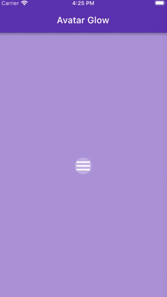</img></td>
  </tr>
  <tr>
    <td>2</td>
    <td><a href="/lib/2_google_fonts/googlefonts.dart">Google Fonts</a></td>
    <td>&emsp;&emsp;&emsp;&emsp;&emsp;&emsp;&emsp;&emsp;&emsp;&emsp;&emsp;&emsp;
        
    <a href="https://pub.dev/packages/google_fonts" target="_blank">google_fonts: ^3.0.1</a>        
    </td>
    <td></img></td>
  </tr>
  <tr>
    <td>3</td>
    <td><a href="/lib/3_liquid_pull_to_refresh/pull_to_refresh.dart">Liquid Pull To Refresh</a></td>
    <td><a href="https://pub.dev/packages/liquid_pull_to_refresh" target="_blank">liquid_pull_to_refresh: ^3.0.1</a></td>
    <td>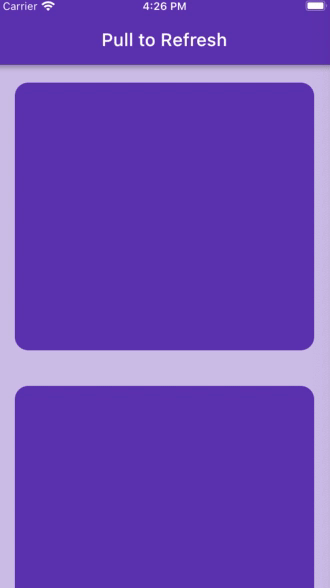</img></td>
  </tr>
  <tr>
    <td>4</td>
    <td><a href="/lib/4_percent_indicator/percent_indicator.dart">Percent Indicator</a></td>
    <td><a href="https://pub.dev/packages/percent_indicator" target="_blank">percent_indicator: ^4.2.2</a></td>
    <td>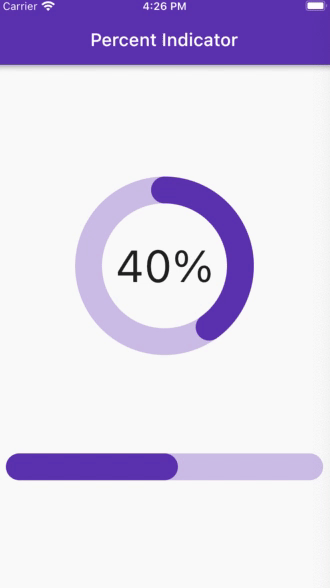</img></td>
  </tr>
  <tr>
    <td>5</td>
    <td><a href="/lib/5_carousel_slider/carousel_slider.dart">Carousel Slider</a></td>
    <td><a href="https://pub.dev/packages/flutter_carousel_slider" target="_blank">flutter_carousel_slider: ^1.0.8</a></td>
    <td>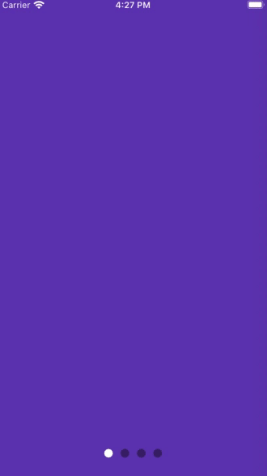</img></td>
  </tr>
  <tr>
    <td>6</td>
    <td><a href="/lib/6_smooth_page_indicator/smooth_page_indicator.dart">Smooth Page Indicator</a></td>
    <td><a href="https://pub.dev/packages/smooth_page_indicator" target="_blank">smooth_page_indicator: ^1.0.0+2</a></td>
    <td>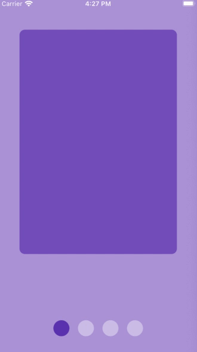</img></td>
  </tr>
  <tr>
    <td>7</td>
    <td><a href="/lib/7_font_awesome_flutter/font_awesome_flutter.dart">Font Awesome Flutter</a></td>
    <td>&emsp;&emsp;&emsp;&emsp;&emsp;&emsp;&emsp;&emsp;&emsp;&emsp;&emsp;&emsp;
        
    <a href="https://pub.dev/packages/font_awesome_flutter" target="_blank">font_awesome_flutter: ^10.1.0</a>        
    </td>
    <td>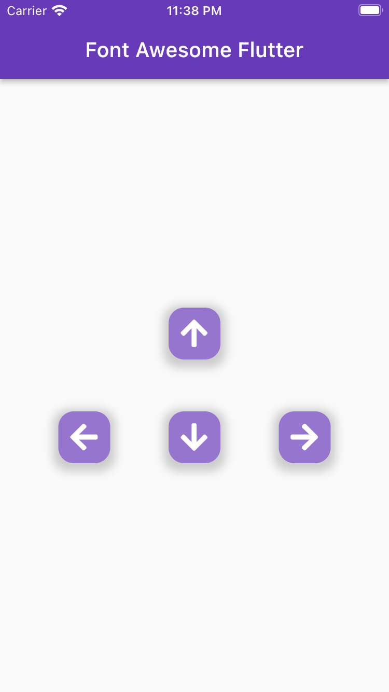</img></td>
  </tr>
  <tr>
    <td>8</td>
    <td><a href="/lib/8_animations/animations.dart">Animations</a></td>
    <td><a href="https://pub.dev/packages/animations" target="_blank">animations: ^2.0.3</a></td>
    <td>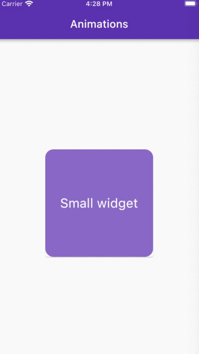</img></td>
  </tr>
  <tr>
    <td>9</td>
    <td><a href="/lib/9_neon/neon.dart">Neon</a></td>
    <td><a href="https://pub.dev/packages/neon" target="_blank">neon: ^0.1.0</a></td>
    <td>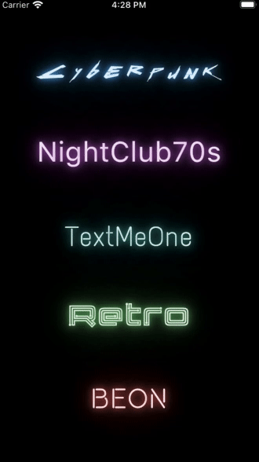</img></td>
  </tr>
  <tr>
    <td>10</td>
    <td><a href="/lib/10_aurora_gradient/aurora.dart">Aurora</a></td>
    <td><a href="https://pub.dev/packages/aurora" target="_blank">aurora: ^1.0.0</a></td>
    <td>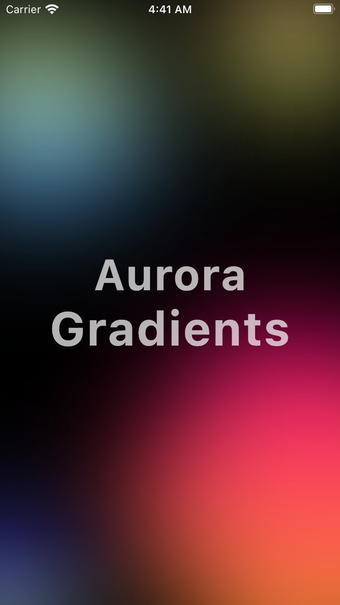</img></td>
  </tr>
  <tr>
    <td>11</td>
    <td><a href="/lib/11_card_swiper/card_swiper.dart">Card Swiper</a></td>
    <td><a href="https://pub.dev/packages/card_swiper" target="_blank">card_swiper: ^2.0.4</a></td>
    <td>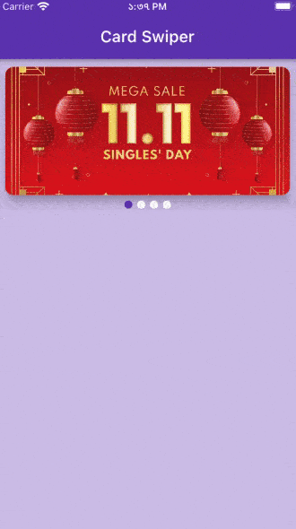</img></td>
  </tr>
  <tr>
    <td>12</td>
    <td><a href="/lib/12_flutter_blurhash/flutter_blurhash.dart">Flutter BlurHash</a></td>
    <td><a href="https://pub.dev/packages/flutter_blurhash" target="_blank">flutter_blurhash: ^0.7.0</a></td>
    <td></img></td>
  </tr>
  <tr>
    <td>13</td>
    <td><a href="/lib/13_flutter_SVG/flutter_svg.dart">Flutter SVG</a></td>
    <td>&emsp;&emsp;&emsp;&emsp;&emsp;&emsp;&emsp;&emsp;&emsp;&emsp;&emsp;&emsp;
        
    <a href="https://pub.dev/packages/flutter_svg" target="_blank">flutter_svg: ^1.1.0</a>        
    </td>
    <td>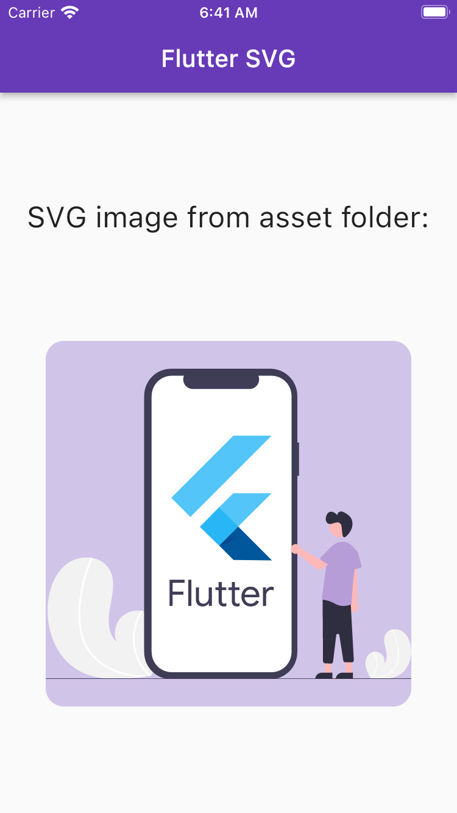</img></td>
  </tr>
  <tr>
    <td>14</td>
    <td><a href="/lib/14_flutter_custom_clippers/flutter_custom_clippers.dart">Flutter Custom Clipper</a></td>
    <td><a href="https://pub.dev/packages/flutter_custom_clippers" target="_blank">flutter_custom_clippers: ^2.0.0</a></td>
    <td>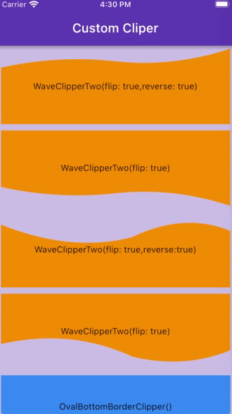</img></td>
  </tr>
  <tr>
    <td>15</td>
    <td><a href="/lib/15_flutter_tts/flutter_tts.dart">Flutter TTS</a></td>
    <td><a href="https://pub.dev/packages/flutter_tts" target="_blank">flutter_tts: ^3.3.3</a></td>
    <td>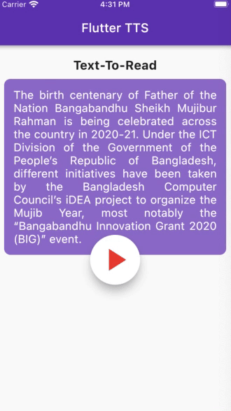</img></td>
  </tr>
  <tr>
    <td>16</td>
    <td><a href="/lib/16_flutter_highlight/flutter_highlight.dart">Flutter Highlight</a></td>
    <td><a href="https://pub.dev/packages/flutter_highlight" target="_blank">flutter_highlight: ^0.7.0</a></td>
    <td></img></td>
  </tr>
  <tr>
    <td>17</td>
    <td><a href="/lib/17_syncfusion_flutter_charts/syncfusion_flutter_charts.dart">Syncfusion Charts</a></td>
    <td><a href="https://pub.dev/packages/syncfusion_flutter_charts" target="_blank">syncfusion_flutter_charts: ^20.1.57</a></td>
    <td>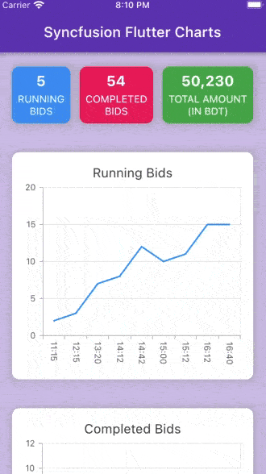</img></td>
  </tr>
  <tr>
    <td>18</td>
    <td><a href="/lib/18_rflutter_alert/rflutter_alert.dart">Rflutter Alert</a></td>
    <td><a href="https://pub.dev/packages/rflutter_alert" target="_blank">rflutter_alert: ^2.0.4</a></td>
    <td>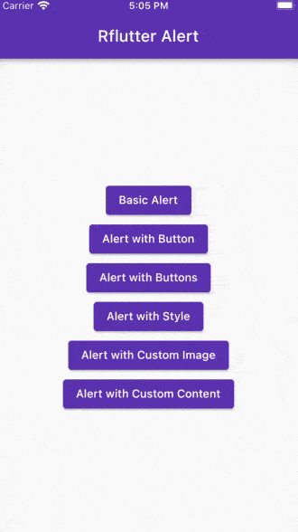</img></td>
  </tr>
  <tr>
    <td>19</td>
    <td><a href="/lib/19_flutter_settings_ui/flutter_settings_ui.dart">Settings UI</a></td>
    <td><a href="https://pub.dev/packages/flutter_settings_ui" target="_blank">flutter_settings_ui: ^2.0.1</a></td>
    <td>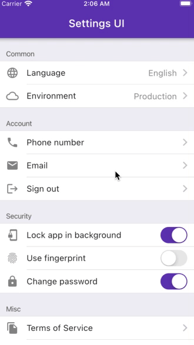</img></td>
  </tr>
  <tr>
    <td>20</td>
    <td><a href="/lib/20_flutter_spinkit/flutter_spinkit.dart">Flutter Spinkit</a></td>
    <td><a href="https://pub.dev/packages/flutter_spinkit" target="_blank">flutter_spinkit: ^5.1.0</a></td>
    <td>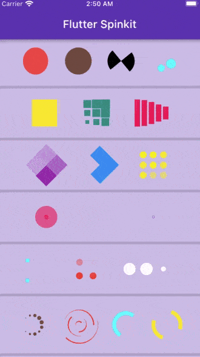</img></td>
  </tr>
  <tr>
    <td>21</td>
    <td><a href="/lib/21_audioplayers/audioplayers.dart">Audio Players</a></td>
    <td><a href="https://pub.dev/packages/audioplayers" target="_blank">audioplayers: ^0.20.1</a></td>
    <td>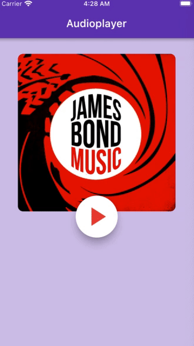</img></td>
  </tr>
  <tr>
    <td>22</td>
    <td><a href="/lib/22_go_router/go_router.dart">Go Router</a></td>
    <td>&emsp;&emsp;&emsp;&emsp;&emsp;&emsp;&emsp;&emsp;&emsp;&emsp;&emsp;&emsp;
        
    <a href="https://pub.dev/packages/go_router" target="_blank">go_router: ^3.1.1</a>        
    </td>
    <td></img></td>
  </tr>
  <tr>
    <td>23</td>
    <td><a href="/lib/23_http/http.dart">HTTP</a></td>
    <td><a href="https://pub.dev/packages/http" target="_blank">http: ^0.13.4</a></td>
    <td>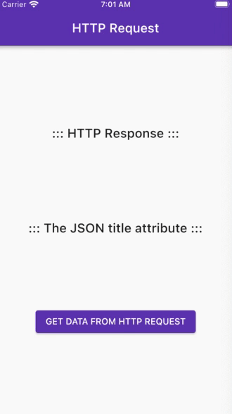</img></td>
  </tr>
  <tr>
    <td>24</td>
    <td><a href="/lib/24_onboarding/onboarding.dart">Onboarding</a></td>
    <td><a href="https://pub.dev/packages/onboarding" target="_blank">onboarding: ^3.1.0</a></td>
    <td>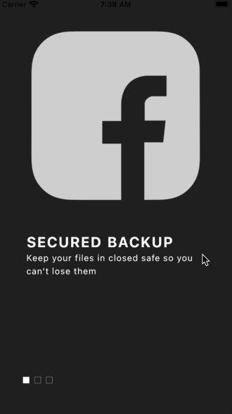</img></td>
  </tr>
  <tr>
    <td>25</td>
    <td><a href="/lib/25_flutter_neumorphic/flutter_neumorphic.dart">Flutter Neumorphic</a></td>
    <td><a href="https://pub.dev/packages/flutter_neumorphic" target="_blank">flutter_neumorphic: ^3.2.0</a></td>
    <td>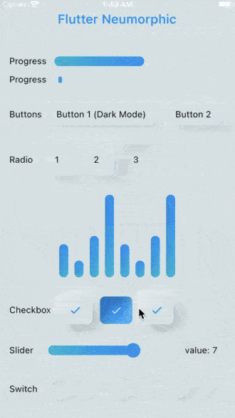</img></td>
  </tr>
  <tr>
    <td>26</td>
    <td><a href="/lib/26_math_expressions/math_expressions.dart">Math Expressions</a></td>
    <td><a href="https://pub.dev/packages/math_expressions" target="_blank">math_expressions: ^2.3.0</a></td>
    <td>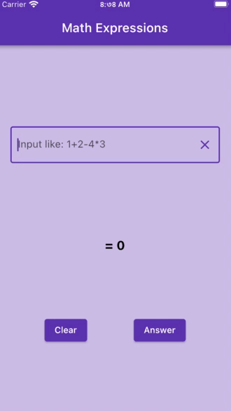</img></td>
  </tr>
  <tr>
    <td>27</td>
    <td><a href="/lib/27_clay_containers/clay_containers.dart">Clay Containers</a></td>
    <td><a href="https://pub.dev/packages/clay_containers" target="_blank">clay_containers: ^0.3.2</a></td>
    <td>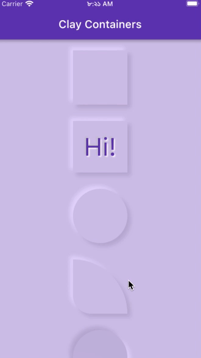</img></td>
  </tr>
  <tr>
    <td>28</td>
    <td><a href="/lib/28_day_night_switcher/day_night_switcher.dart">Day Night Switcher</a></td>
    <td>&emsp;&emsp;&emsp;&emsp;&emsp;&emsp;&emsp;&emsp;
    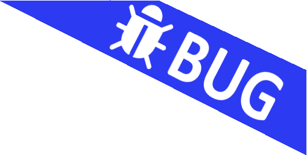     
    <a href="https://pub.dev/packages/day_night_switcher" target="_blank">day_night_switcher: ^0.2.0+1</a>        
    </td>
    <td>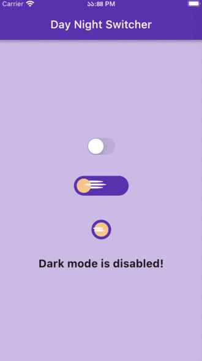</img></td>
  </tr>
  <tr>
    <td>29</td>
    <td><a href="lib/29_provider/my_provider.dart">Provider</a></td>
    <td>&emsp;&emsp;&emsp;&emsp;&emsp;&emsp;&emsp;&emsp;&emsp;&emsp;&emsp;&emsp;
        
    <a href="https://pub.dev/packages/provider" target="_blank">provider: ^6.0.3</a>        
    </td>
    <td>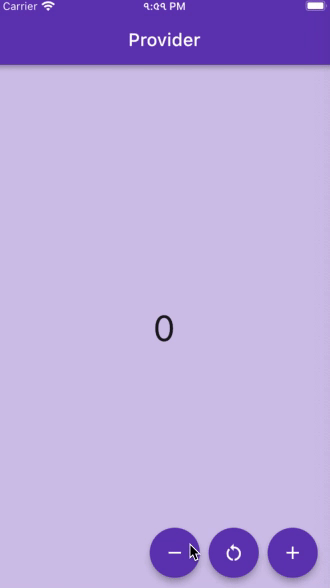</img></td>
  </tr>
  <tr>
    <td>30</td>
    <td><a href="lib/30_feather_icons/feather_icons.dart">Feather Icons</a></td>
    <td><a href="https://pub.dev/packages/feather_icons" target="_blank">feather_icons: ^1.2.0</a></td>
    <td>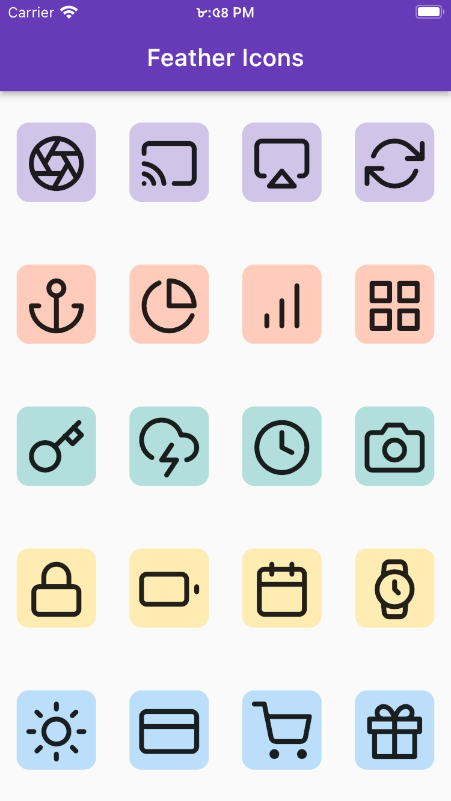</img></td>
  </tr>
  <tr>
    <td>31</td>
    <td><a href="lib/31_simple_gradient_text/simple_gradient_text.dart">Simple Gradient Text</a></td>
    <td><a href="https://pub.dev/packages/simple_gradient_text" target="_blank">simple_gradient_text: ^1.2.3</a></td>
    <td>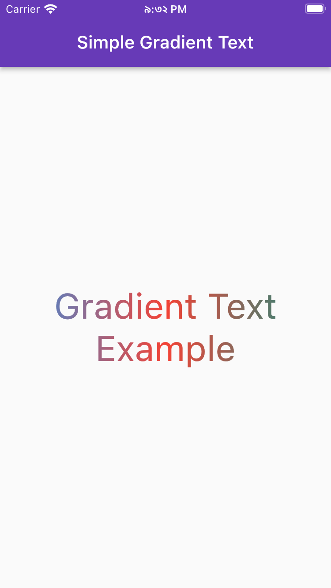</img></td>
  </tr>
  <tr>
    <td>32</td>
    <td><a href="lib/32_image_picker/image_picker.dart">Image Picker</a></td>
    <td><a href="https://pub.dev/packages/image_picker" target="_blank">image_picker: ^0.8.5+3</a></td>
    <td>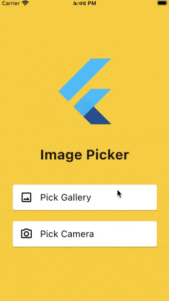</img></td>
  </tr>
  <tr>
    <td>33</td>
    <td><a href="lib/33_convex_bottom_bar/convex_bottom_bar.dart">Convex Bottom Bar</a></td>
    <td>&emsp;&emsp;&emsp;&emsp;&emsp;&emsp;&emsp;&emsp;&emsp;&emsp;&emsp;&emsp;
        
    <a href="https://pub.dev/packages/convex_bottom_bar" target="_blank">convex_bottom_bar: ^3.0.0</a>        
    </td>
    <td>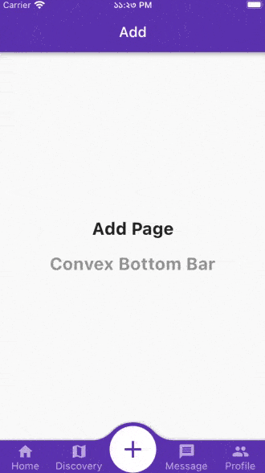</img></td>
  </tr>
  <tr>
    <td>34</td>
    <td><a href="lib/34_intro_slider/intro_slider.dart">Intro Slider</a></td>
    <td><a href="https://pub.dev/packages/intro_slider" target="_blank">intro_slider: ^3.0.5</a></td>
    <td>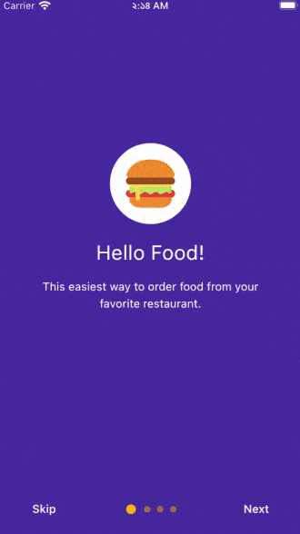</img></td>
  </tr>
  <tr>
    <td>35</td>
    <td><a href="lib/35_icofont_flutter/icofont_flutter.dart">Icofont Flutter</a></td>
    <td><a href="https://pub.dev/packages/icofont_flutter" target="_blank">icofont_flutter: ^1.4.0</a></td>
    <td>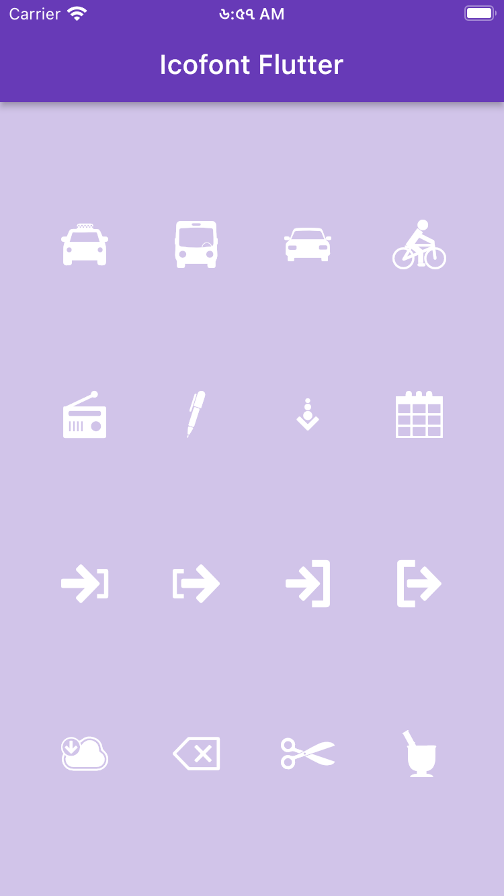</img></td>
  </tr>
  <tr>
    <td>36</td>
    <td><a href="lib/36_flutter_staggered_grid_view/flutter_staggered_grid_view.dart">Flutter Staggered Grid View</a></td>
    <td><a href="https://pub.dev/packages/flutter_staggered_grid_view" target="_blank">flutter_staggered_grid_view: ^0.6.1</a></td>
    <td>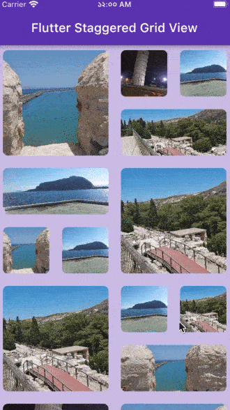</img></td>
  </tr>
  <tr>
    <td>37</td>
    <td><a href="lib/37_shimmer/shimmer.dart">Shimmer</a></td>
    <td><a href="https://pub.dev/packages/shimmer" target="_blank">shimmer: ^2.0.0</a></td>
    <td>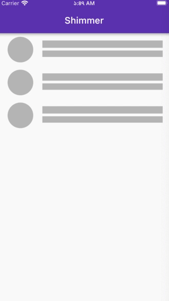</img></td>
  </tr>
  <tr>
    <td>38</td>
    <td><a href="lib/38_lottie/lottie.dart">Lottie</a></td>
    <td><a href="https://pub.dev/packages/lottie" target="_blank">lottie: ^1.3.0</a></td>
    <td>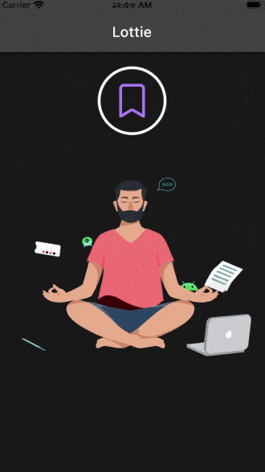</img></td>
  </tr>
  <tr>
    <td>39</td>
    <td><a href="lib/39_shared_preferences/shared_preferences.dart">Shared Preferences</a></td>
    <td>&emsp;&emsp;&emsp;&emsp;&emsp;&emsp;&emsp;&emsp;&emsp;&emsp;&emsp;&emsp;
        
    <a href="https://pub.dev/packages/shared_preferences" target="_blank">shared_preferences: ^2.0.15</a>        
    </td>
    <td>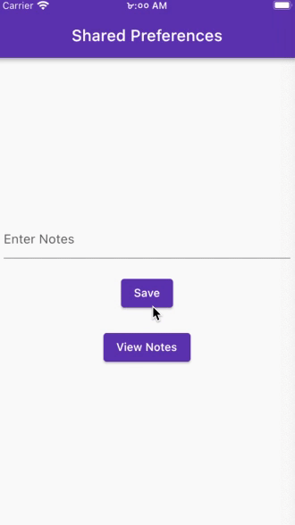</img></td>
  </tr>
  <tr>
    <td>40</td>
    <td><a href="lib/40_auto_size_text/auto_size_text.dart">Auto Size Text</a></td>
    <td>&emsp;&emsp;&emsp;&emsp;&emsp;&emsp;&emsp;&emsp;&emsp;&emsp;&emsp;&emsp;
        
    <a href="https://pub.dev/packages/auto_size_text" target="_blank">auto_size_text: ^3.0.0</a>        
    </td>
    <td>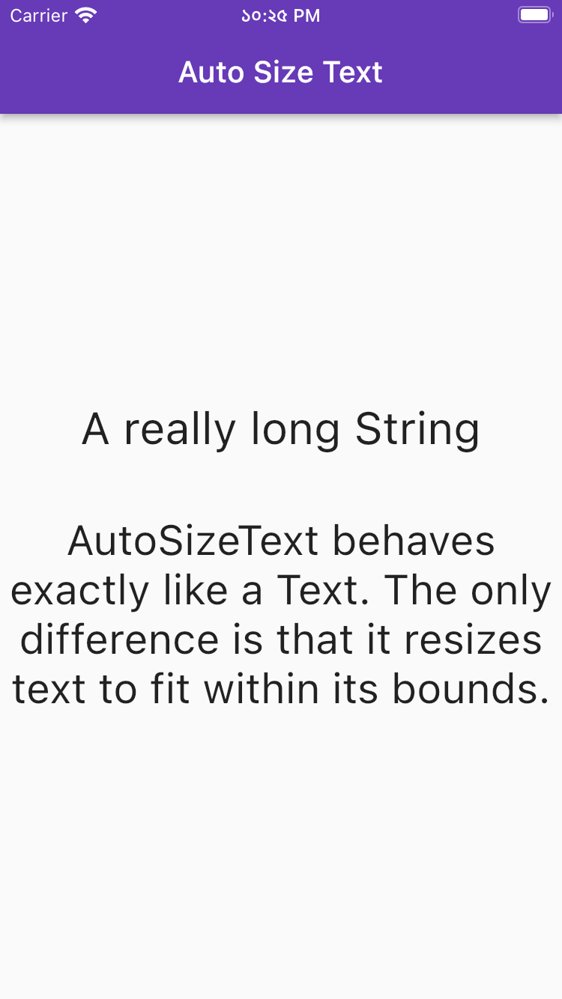</img></td>
  </tr>
  <tr>
    <td>41</td>
    <td><a href="lib/41_device_info_plus/device_info_plus.dart">Device Info Plus</a></td>
    <td>&emsp;&emsp;&emsp;&emsp;&emsp;&emsp;&emsp;&emsp;&emsp;&emsp;&emsp;&emsp;
        
    <a href="https://pub.dev/packages/device_info_plus" target="_blank">device_info_plus: ^3.2.3</a>        
    </td>
    <td>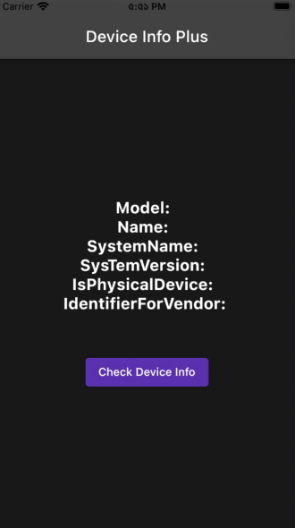</img></td>
  </tr>
  <tr>
    <td>42</td>
    <td><a href="lib/42_geolocator/geolocator.dart">Geolocator</a></td>
    <td>&emsp;&emsp;&emsp;&emsp;&emsp;&emsp;&emsp;&emsp;&emsp;&emsp;&emsp;&emsp;
        
    <a href="https://pub.dev/packages/geolocator" target="_blank">geolocator: ^8.2.1</a>        
    </td>
    <td>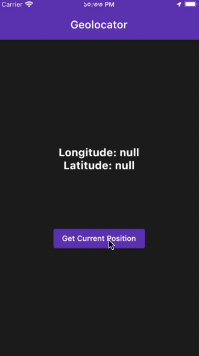</img></td>
  </tr>
  <tr>
    <td>43</td>
    <td><a href="lib/43_glass_kit/glass_kit.dart">Glass Kit</a></td>
    <td><a href="https://pub.dev/packages/glass_kit#getting-started" target="_blank">glass_kit: ^2.0.1</a></td>
    <td>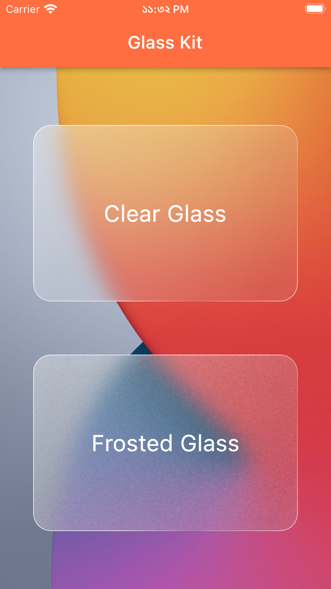</img></td>
  </tr>
  <tr>
    <td>44</td>
    <td><a href="lib/44_url_launcher/url_launcher.dart">URL Launcher</a></td>
    <td>&emsp;&emsp;&emsp;&emsp;&emsp;&emsp;&emsp;&emsp;&emsp;&emsp;&emsp;&emsp;
        
    <a href="https://pub.dev/packages/url_launcher" target="_blank">url_launcher: ^6.1.2</a>        
    </td>
    <td>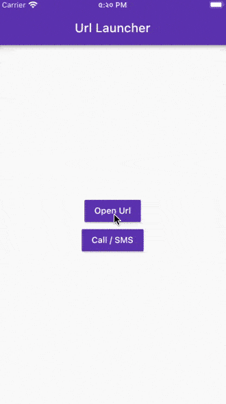</img></td>
  </tr>
  <tr>
    <td>45</td>
    <td><a href="lib/45_webview_flutter/webview_flutter.dart">Webview Flutter</a></td>
    <td><a href="https://pub.dev/packages/webview_flutter" target="_blank">webview_flutter: ^3.0.4</a></td>
    <td>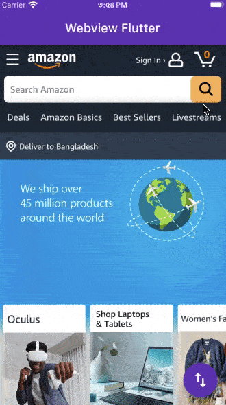</img></td>
  </tr>
  <tr>
    <td>46</td>
    <td><a href="lib/46_responsive_sizer/responsive_sizer.dart">Responsive Sizer</a></td>
    <td><a href="https://pub.dev/packages/responsive_sizer" target="_blank">responsive_sizer: ^3.0.8</a></td>
    <td>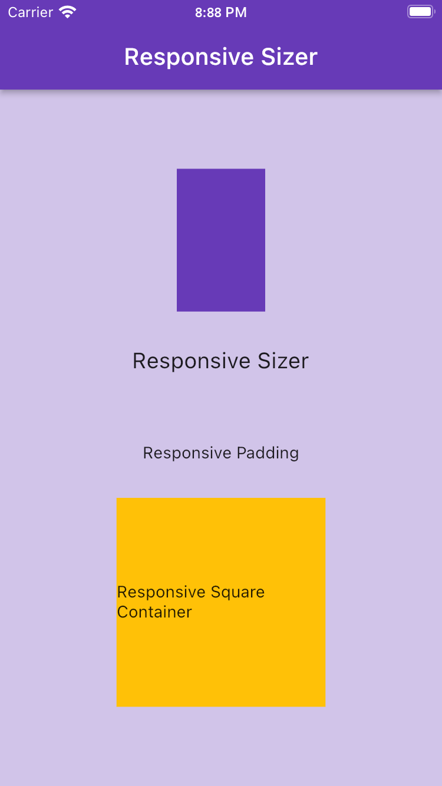</img></td>
  </tr>
  <tr>
    <td>47</td>
    <td><a href="lib/47_video_player/video_player.dart">Video Player</a></td>
    <td><a href="https://pub.dev/packages/video_player" target="_blank">video_player: ^2.4.2</a></td>
    <td>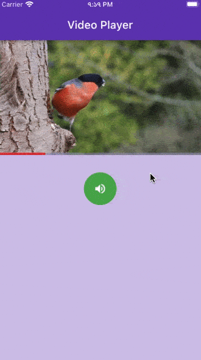</img></td>
  </tr>
  <tr>
    <td>48</td>
    <td><a href="lib/48_responsive_framework/responsive_framework.dart">Responsive Framework</a></td>
    <td><a href="https://pub.dev/packages/responsive_framework" target="_blank">responsive_framework: ^0.2.0</a></td>
    <td>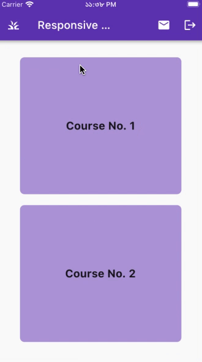</img></td>
  </tr>
  <tr>
    <td>49</td>
    <td><a href="lib/49_timelines/timelines.dart">Timelines</a></td>
    <td><a href="https://pub.dev/packages/timelines" target="_blank">timelines: ^0.1.0</a></td>
    <td></img></td>
  </tr>
  <tr>
    <td>50</td>
    <td><a href="lib/50_just_audio/just_audio.dart">Just Audio</a></td>
    <td>&emsp;&emsp;&emsp;&emsp;&emsp;&emsp;&emsp;&emsp;&emsp;&emsp;&emsp;&emsp;
        
    <a href="https://pub.dev/packages/just_audio" target="_blank">just_audio: ^0.9.21</a>        
    </td>
    <td>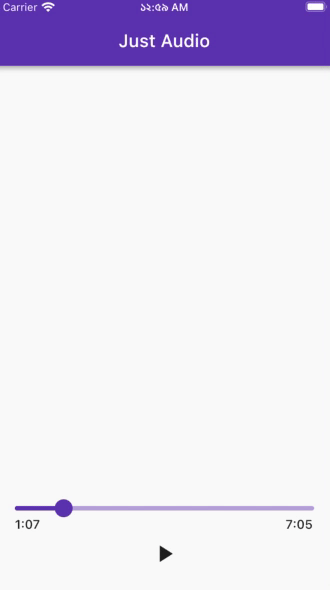</img></td>
  </tr>
  <tr>
    <td>51</td>
    <td><a href="lib/51_persistent_bottom_nav_bar/bottom_nav_bar.dart">Persistent BNb v2</a></td>
    <td><a href="https://pub.dev/packages/persistent_bottom_nav_bar_v2" target="_blank">persistent_b_n_b_v2: ^4.2.3</a></td>
    <td>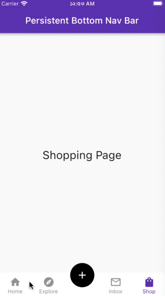</img></td>
  </tr>
  <tr>
    <td>52</td>
    <td><a href="lib/52_equatable/equatable.dart">Equatable</a></td>
    <td><a href="https://pub.dev/packages/equatable" target="_blank">equatable: ^2.0.3</a></td>
    <td>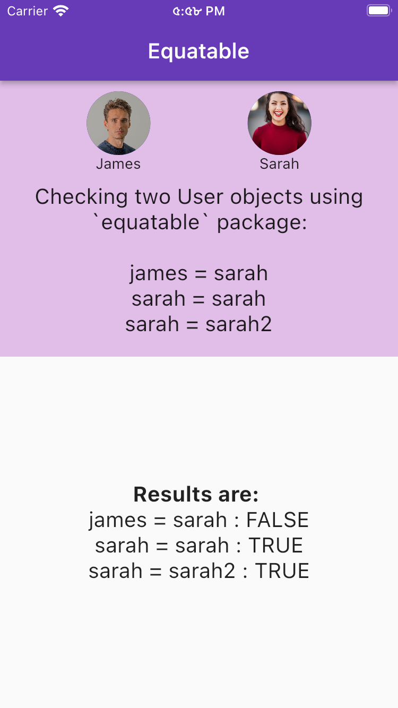</img></td>
  </tr>
  <tr>
    <td>53</td>
    <td><a href="lib/53_web_scraper/web_scraper.dart">Web Scraper</a></td>
    <td><a href="https://pub.dev/packages/web_scraper" target="_blank">web_scraper: ^0.1.4</a></td>
    <td>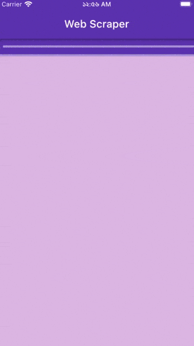</img></td>
  </tr>
  <tr>
    <td>54</td>
    <td><a href="lib/54_introduction_screen/onbording_screen.dart">Introduction Screen</a></td>
    <td><a href="https://pub.dev/packages/introduction_screen" target="_blank">introduction_screen: ^3.0.2</a></td>
    <td>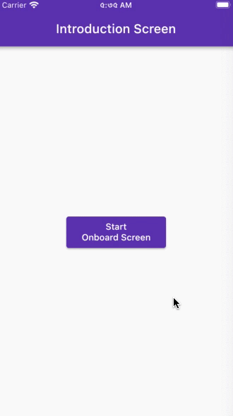</img></td>
  </tr>
  <tr>
    <td>55</td>
    <td><a href="lib/55_animated_text_kit/animated_text_kit.dart">Animated Text Kit</a></td>
    <td>&emsp;&emsp;&emsp;&emsp;&emsp;&emsp;&emsp;&emsp;&emsp;&emsp;&emsp;&emsp;
        
    <a href="https://pub.dev/packages/animated_text_kit" target="_blank">animated_text_kit: ^4.2.2</a>        
    </td>
    <td>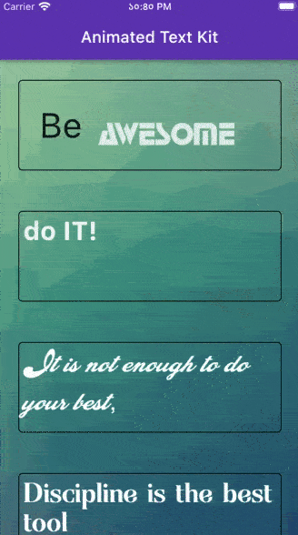</img></td>
  </tr>
  <tr>
    <td>56</td>
    <td><a href="lib/56_horizontal_data_table/horizontal_data_table.dart">Horizontal Data Table</a></td>
    <td><a href="https://pub.dev/packages/horizontal_data_table" target="_blank">horizontal_data_table: ^4.0.0</a></td>
    <td>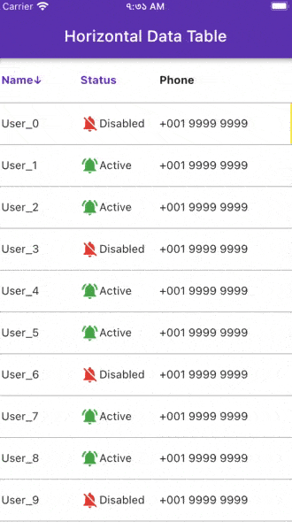</img></td>
  </tr>
  <tr>
    <td>57</td>
    <td><a href="lib/57_confetti/confetti.dart">Confetti</a></td>
    <td><a href="https://pub.dev/packages/confetti" target="_blank">confetti: ^0.7.0</a></td>
    <td></img></td>
  </tr>
  <tr>
    <td>58</td>
    <td><a href="lib/58_chewie/chewie_player.dart">Chewie</a></td>
    <td>
    <a href="https://pub.dev/packages/chewie" target="_blank">chewie: ^1.3.3</a> 
    <a href="https://pub.dev/packages/video_player" target="_blank">video_player: ^2.4.2</a>
    </td>
    <td>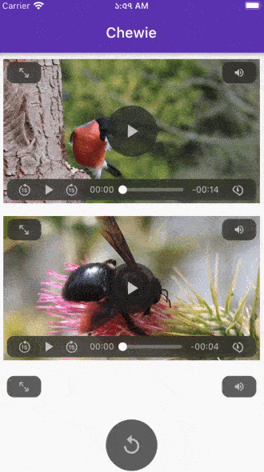</img></td>
  </tr>
  <tr>
    <td>59</td>
    <td><a href="lib/59_get_it/get_it.dart">Get It</a></td>
    <td>
    <a href="https://pub.dev/packages/get_it" target="_blank">get_it: ^7.2.0</a>
    </td>
    <td>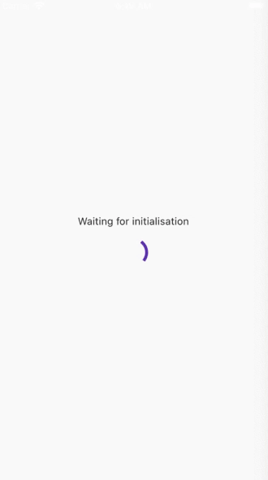</img></td>
  </tr>
  <tr>
    <td>60</td>
    <td><a href="lib/60_overlay_support/overlay_support.dart">Overlay Support</a></td>
    <td>
    <a href="https://pub.dev/packages/overlay_support" target="_blank">overlay_support: ^2.0.1</a>
    </td>
    <td>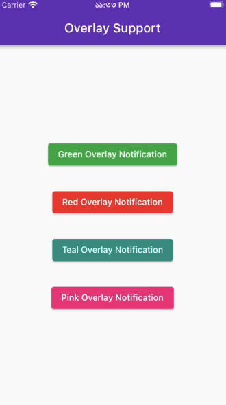</img></td>
  </tr>
  <tr>
    <td>61</td>
    <td><a href="lib/61_connectivity_plus/connectivity_plus.dart">Connectivity Plus</a>
    </td>
    <td>&emsp;&emsp;&emsp;&emsp;&emsp;&emsp;&emsp;&emsp;&emsp;&emsp;&emsp;&emsp;
        
    <a href="https://pub.dev/packages/connectivity_plus" target="_blank">connectivity_plus: ^2.3.2</a> [F.F.] 
    <a href="https://pub.dev/packages/overlay_support" target="_blank">overlay_support: ^2.0.1</a>        
    </td>
    <td>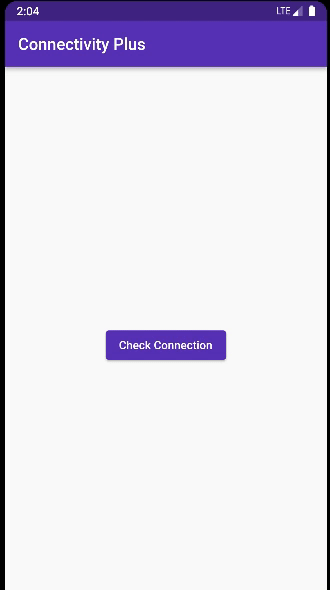</img></td>
  </tr>
  <tr>
    <td>62</td>
    <td><a href="lib/62_flutter_hooks/flutter_hooks.dart">Flutter Hooks</a></td>
    <td><a href="https://pub.dev/packages/flutter_hooks" target="_blank">flutter_hooks: ^0.18.4</a></td>
    <td>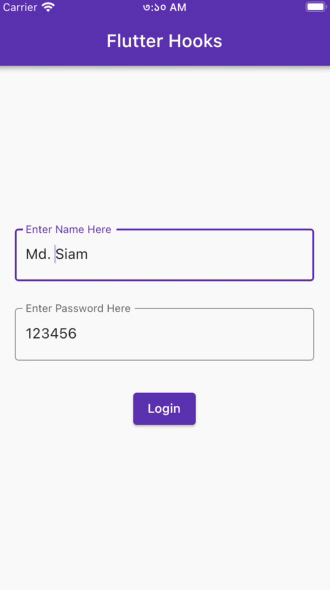</img></td>
  </tr>
  <tr>
    <td>63</td>
    <td><a href="lib/63_path_provider/path_provider.dart">Path Provider</a></td>
    <td>&emsp;&emsp;&emsp;&emsp;&emsp;&emsp;&emsp;&emsp;&emsp;&emsp;&emsp;&emsp;
        
    <a href="https://pub.dev/packages/path_provider" target="_blank">path_provider: ^2.0.10</a>        
    </td>
    <td>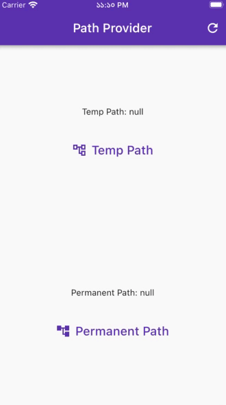</img></td>
  </tr>
  <tr>
    <td>64</td>
    <td><a href="lib/64_youtube_player_flutter/youtube_player_flutter.dart">Youtube Player Flutter</a></td>
    <td><a href="https://pub.dev/packages/youtube_player_flutter" target="_blank">youtube_player_flutter: ^8.1.0</a></td>
    <td>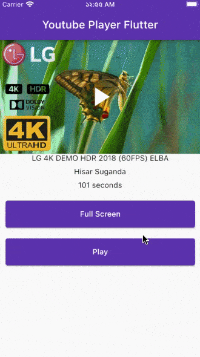</img></td>
  </tr>
  <tr>
    <td>65</td>
    <td><a href="lib/65_youtube_player_iframe/youtube_player_iframe.dart">Youtube Player Iframe</a></td>
    <td><a href="https://pub.dev/packages/youtube_player_iframe" target="_blank">youtube_player_iframe: ^2.3.0</a></td>
    <td></img></td>
  </tr>
  <tr>
    <td>66</td>
    <td><a href="lib/66_flutter_slidable/flutter_slidable.dart">Flutter Slidable</a></td>
    <td>&emsp;&emsp;&emsp;&emsp;&emsp;&emsp;&emsp;&emsp;&emsp;&emsp;&emsp;&emsp;
        
    <a href="https://pub.dev/packages/flutter_slidable" target="_blank">flutter_slidable: ^1.3.0</a>        
    </td>
    <td>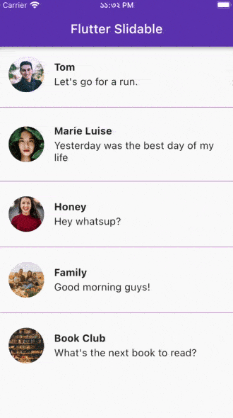</img></td>
  </tr>
  <tr>
    <td>67</td>
    <td><a href="lib/67_json_annotation/json_annotation.dart">JSON Annotation</a></td>
    <td>&emsp;&emsp;&emsp;&emsp;&emsp;&emsp;&emsp;&emsp;&emsp;&emsp;&emsp;&emsp;
        
    <a href="https://pub.dev/packages/json_annotation" target="_blank">json_annotation: ^4.5.0</a> 
    <a href="https://pub.dev/packages/json_serializable" target="_blank">json_serializable: ^6.2.0</a> [F.F.] 
    <a href="https://pub.dev/packages/build_runner" target="_blank">build_runner: ^2.1.11</a>
          
    </td>
    <td>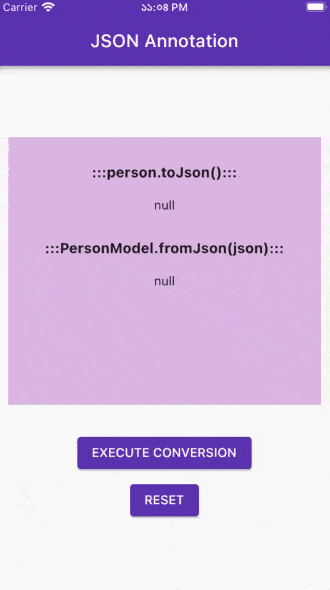</img></td>
  </tr>
  <tr>
    <td>68</td>
    <td><a href="lib/68_dio/dio.dart">Dio</a></td>
    <td><a href="https://pub.dev/packages/dio" target="_blank">dio: ^4.0.6</a></td>
    <td>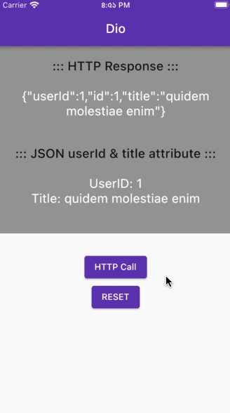</img></td>
  </tr>
  <tr>
    <td>69</td>
    <td><a href="lib/69_gallery_saver/gallery_saver.dart">Gallery Saver</a></td>
    <td><a href="https://pub.dev/packages/gallery_saver" target="_blank">gallery_saver: ^2.3.2</a></td>
    <td>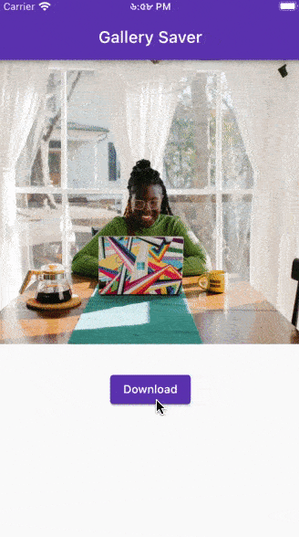</img></td>
  </tr>
  <tr>
    <td>70</td>
    <td><a href="lib/70_anim_search_bar/anim_search_bar.dart">Anim Search Bar</a></td>
    <td><a href="https://pub.dev/packages/anim_search_bar" target="_blank">anim_search_bar: ^2.0.2</a></td>
    <td></img></td>
  </tr>
  <tr>
    <td>71</td>
    <td><a href="lib/71_file_picker/file_picker.dart">File Picker</a></td>
    <td>
    <a href="https://pub.dev/packages/file_picker" target="_blank">file_picker: ^4.6.1</a> 
    <a href="https://pub.dev/packages/open_file" target="_blank">open_file: ^3.2.1</a>
    </td>
    <td>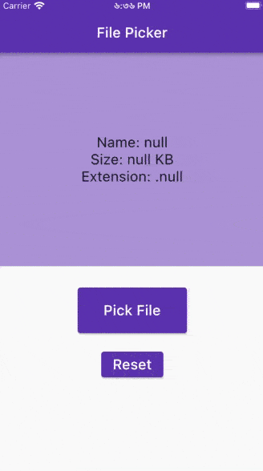</img></td>
  </tr>
  <tr>
    <td>72</td>
    <td><a href="lib/72_share_plus/share_plus.dart">Share Plus</a></td>
    <td>&emsp;&emsp;&emsp;&emsp;&emsp;&emsp;&emsp;&emsp;&emsp;&emsp;&emsp;&emsp;
        
    <a href="https://pub.dev/packages/share_plus" target="_blank">share_plus: ^4.0.6</a>        
    </td>
    <td>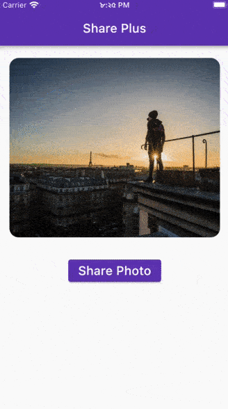</img></td>
  </tr>
  <tr>
    <td>73</td>
    <td><a href="lib/73_infinite_scroll_pagination/infinite_scroll_pagination.dart">Infinite Scroll Pagination</a></td>
    <td>&emsp;&emsp;&emsp;&emsp;&emsp;&emsp;&emsp;&emsp;&emsp;&emsp;&emsp;&emsp;
        
    <a href="https://pub.dev/packages/infinite_scroll_pagination" target="_blank">infinite_scroll_pagination: ^3.2.0</a>        
    </td>
    <td>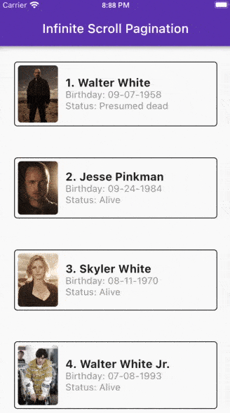</img></td>
  </tr>
  <tr>
    <td>74</td>
    <td><a href="lib/74_marquee/marquee.dart">Marquee</a></td>
    <td><a href="https://pub.dev/packages/marquee" target="_blank">marquee: ^2.2.3</a></td>
    <td>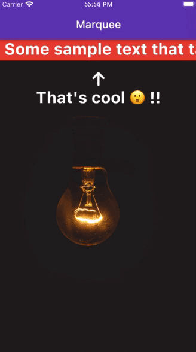</img></td>
  </tr>
  <tr>
    <td>75</td>
    <td><a href="lib/75_cached_network_image/cached_network_image.dart">Cached Network Image</a></td>
    <td>
    <a href="https://pub.dev/packages/cached_network_image" target="_blank">cached_network_image: ^3.2.1</a> 
    <a href="https://pub.dev/packages/flutter_cache_manager" target="_blank">flutter_cache_manager: ^3.3.0</a>
    </td>
    <td>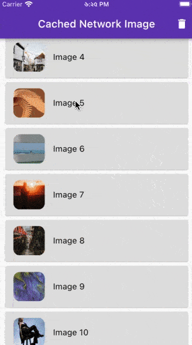</img></td>
  </tr>
  <tr>
    <td>76</td>
    <td><a href="lib/76_fluttertoast/fluttertoast.dart">Flutter Toast</a></td>
    <td><a href="https://pub.dev/packages/fluttertoast" target="_blank">fluttertoast: ^8.0.9</a></td>
    <td>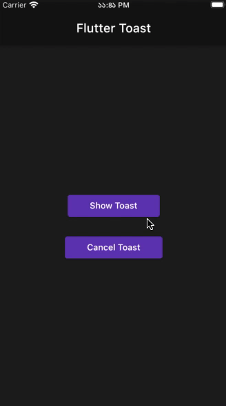</img></td>
  </tr>
  <tr>
    <td>77</td>
    <td><a href="lib/77_crypto/crypto.dart">Crypto</a></td>
    <td><a href="https://pub.dev/packages/crypto" target="_blank">crypto: ^3.0.2</a></td>
    <td>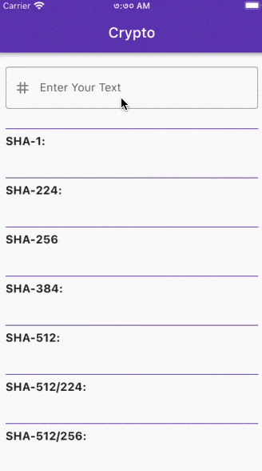</img></td>
  </tr>
  <tr>
    <td>78</td>
    <td><a href="lib/78_bottom_navy_bar/bottom_navy_bar.dart">Bottom Navy Bar</a></td>
    <td>&emsp;&emsp;&emsp;&emsp;&emsp;&emsp;&emsp;&emsp;&emsp;&emsp;&emsp;&emsp;
        
    <a href="https://pub.dev/packages/bottom_navy_bar" target="_blank">bottom_navy_bar: ^6.0.0</a>        
    </td>
    <td>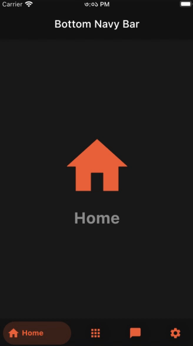</img></td>
  </tr>
  <tr>
    <td>79</td>
    <td><a href="lib/79_slide_countdown/slide_countdown.dart">Slide Countdown</a></td>
    <td>
    <a href="https://pub.dev/packages/slide_countdown" target="_blank">slide_countdown: ^0.2.8</a> 
    <a href="https://pub.dev/packages/confetti" target="_blank">confetti: ^0.7.0</a>
    </td>
    <td>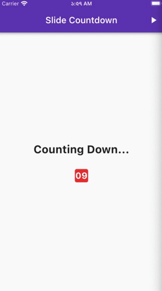</img></td>
  </tr>
  <tr>
    <td>80</td>
    <td><a href="lib/80_date_format/date_format.dart">Date Format</a></td>
    <td><a href="https://pub.dev/packages/date_format" target="_blank">date_format: ^2.0.6</a></td>
    <td>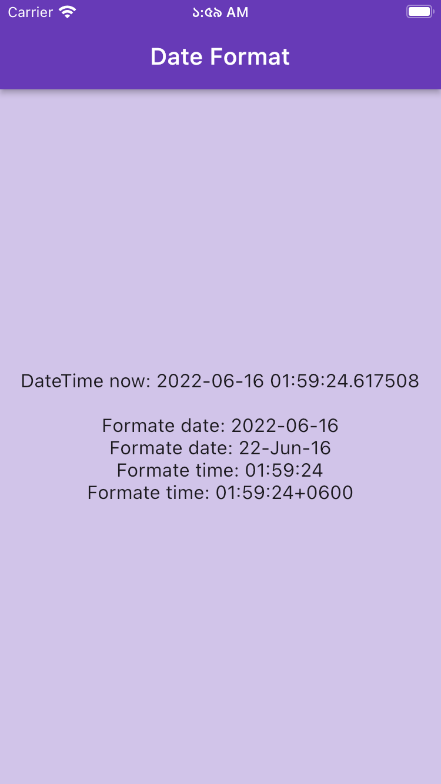</img></td>
  </tr>
  <tr>
    <td>81</td>
    <td><a href="lib/81_flutter_rating_bar/flutter_rating_bar.dart">Flutter Rating Bar</a></td>
    <td><a href="https://pub.dev/packages/flutter_rating_bar" target="_blank">flutter_rating_bar: ^4.0.1</a></td>
    <td>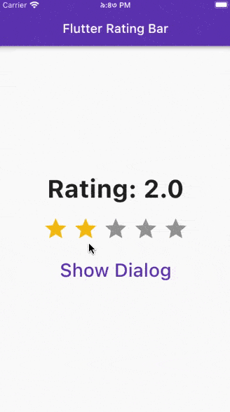</img></td>
  </tr>
  <tr>
    <td>82</td>
    <td><a href="lib/82_pin_code_fields/pin_code_fields.dart">Pin Code Fields</a></td>
    <td><a href="https://pub.dev/packages/pin_code_fields" target="_blank">pin_code_fields: ^7.4.0</a></td>
    <td>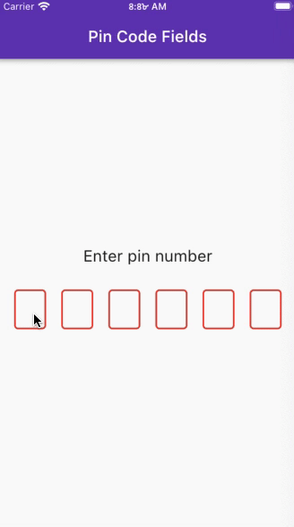</img></td>
  </tr>
  <tr>
    <td>83</td>
    <td><a href="lib/83_uuid/uuid.dart">UUID</a></td>
    <td><a href="https://pub.dev/packages/uuid" target="_blank">uuid: ^3.0.6</a></td>
    <td></img></td>
  </tr>
  <tr>
    <td>84</td>
    <td><a href="lib/84_rxdart/rxdart.dart">RxDart</a></td>
    <td>&emsp;&emsp;&emsp;&emsp;&emsp;&emsp;&emsp;&emsp;&emsp;&emsp;&emsp;&emsp;
        
    <a href="https://pub.dev/packages/rxdart" target="_blank">rxdart: ^0.27.4</a>        
    </td>
    <td>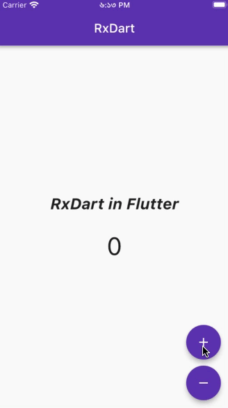</img></td>
  </tr>
  <tr>
    <td>85</td>
    <td><a href="lib/85_flutter_local_notifications/flutter_local_notifications.dart">Flutter Local Notifications</a></td>
    <td>&emsp;&emsp;&emsp;&emsp;&emsp;&emsp;&emsp;&emsp;&emsp;&emsp;&emsp;&emsp;
        
    <a href="https://pub.dev/packages/flutter_local_notifications" target="_blank">flutter_local_notifications: ^9.6.1</a> 
    <a href="https://pub.dev/packages/rxdart" target="_blank">rxdart: ^0.27.4</a>        
    </td>
    <td>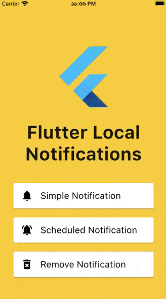</img></td>
  </tr>
  <tr>
    <td>86</td>
    <td><a href="lib/86_flutter_native_timezone/flutter_native_timezone.dart">Flutter Native Timezone</a></td>
    <td><a href="https://pub.dev/packages/flutter_native_timezone" target="_blank">flutter_native_timezone: ^2.0.0</a></td>
    <td>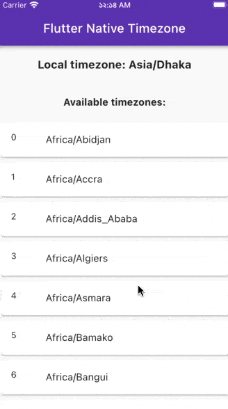</img></td>
  </tr>
  <tr>
    <td>87</td>
    <td><a href="lib/87_faker/faker.dart">Faker</a></td>
    <td><a href="https://pub.dev/packages/faker" target="_blank">faker: ^2.0.0</a></td>
    <td>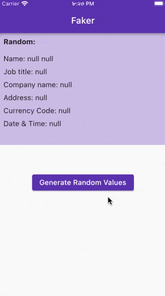</img></td>
  </tr>
  <tr>
    <td>88</td>
    <td><a href="lib/88_day_night_switch/day_night_switch.dart">Day Night Switch</a></td>
    <td><a href="https://pub.dev/packages/day_night_switch" target="_blank">day_night_switch: ^1.0.3</a></td>
    <td>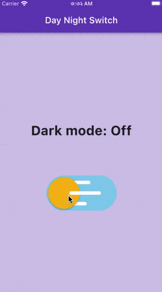</img></td>
  </tr>
  <tr>
    <td>89</td>
    <td><a href="lib/89_pixel_perfect/pixel_perfect.dart">Pixel Perfect</a></td>
    <td><a href="https://pub.dev/packages/pixel_perfect" target="_blank">pixel_perfect: ^1.1.1</a></td>
    <td>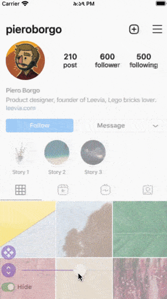</img></td>
  </tr>
  <tr>
    <td>90</td>
    <td><a href="lib/90_animated_button/animated_button.dart">Animated Button</a></td>
    <td><a href="https://pub.dev/packages/animated_button" target="_blank">animated_button: ^0.2.0</a></td>
    <td>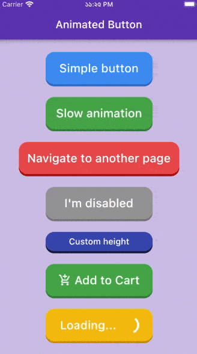</img></td>
  </tr>
  <tr>
    <td>91</td>
    <td><a href="lib/91_toggle_switch/toggle_switch.dart">Toggle Switch</a></td>
    <td>&emsp;&emsp;&emsp;&emsp;&emsp;&emsp;&emsp;&emsp;&emsp;&emsp;&emsp;&emsp;
        
    <a href="https://pub.dev/packages/toggle_switch" target="_blank">toggle_switch: ^2.0.1</a>        
    </td>
    <td>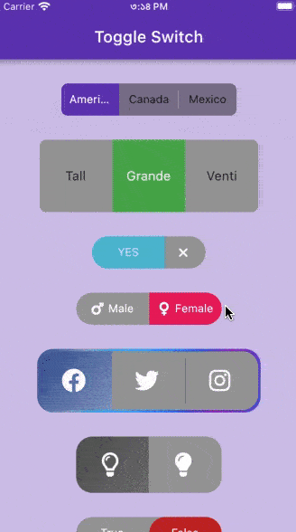</img></td>
  </tr>
  <tr>
    <td>92</td>
    <td><a href="lib/92_routemaster/routemaster.dart">Route Master</a></td>
    <td>&emsp;&emsp;&emsp;&emsp;&emsp;&emsp;&emsp;&emsp;&emsp;&emsp;&emsp;&emsp;
        
    <a href="https://pub.dev/packages/routemaster" target="_blank">routemaster: ^1.0.1</a>        
    </td>
    <td>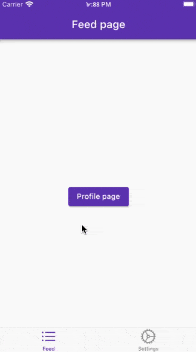</img></td>
  </tr>
</table>
